# Defender-XDR-Detection-Engineering
End-to-end security lab demonstrating MDE environment hardening, persistence attack simulation, and KQL custom detection rule creation.

## Objective
The purpose of this project is to build, configure, and validate a complete Microsoft Defender for Endpoint (MDE) environment from the ground up. The lab covers the full security operations lifecycle: cloud infrastructure provisioning, environment hardening, attack simulation, alert triage, custom detection engineering using KQL, and incident response playbook execution.

## Tools & Technologies
- **Platform:** Microsoft Defender XDR, Microsoft Azure (Virtual Machines)
- **Defensive Engineering:** Attack Surface Reduction (ASR), EDR in Block Mode, Tamper Protection
- **Detection Engineering:** Kusto Query Language (KQL), Near Real-Time (NRT) Rules
- **Framework:** MITRE ATT&CK (T1053, T1106, T1057)

---

## Phase 1: Environment Setup & Hardening
Before simulating threats, it was critical to deploy the infrastructure, ensure sensors were communicating, and establish a secure baseline.

### 1. Infrastructure Provisioning & Onboarding
I provisioned a Windows Virtual Machine in Microsoft Azure and successfully onboarded it to the Defender XDR portal via the local onboarding script.

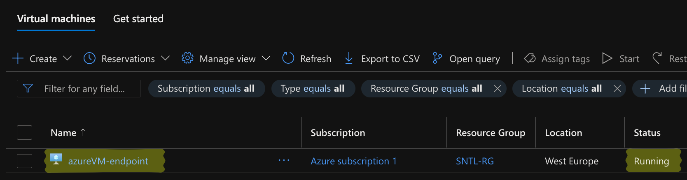
*Description: The Windows Virtual Machine (`azurevm-endpoint`) running in the Azure portal, representing the target endpoint.*

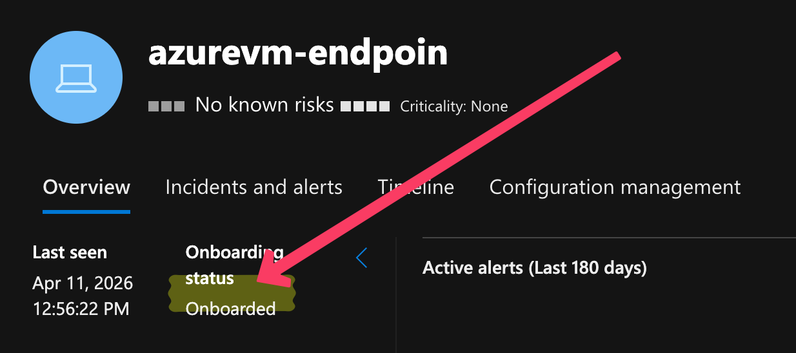
*Description: Verification in the Microsoft Defender portal showing the device successfully communicating and showing an "Onboarded" status.*

### 2. Enabling Core Defender Features
To harden the endpoint against tampering and active threats, I enabled advanced security features globally across the tenant.

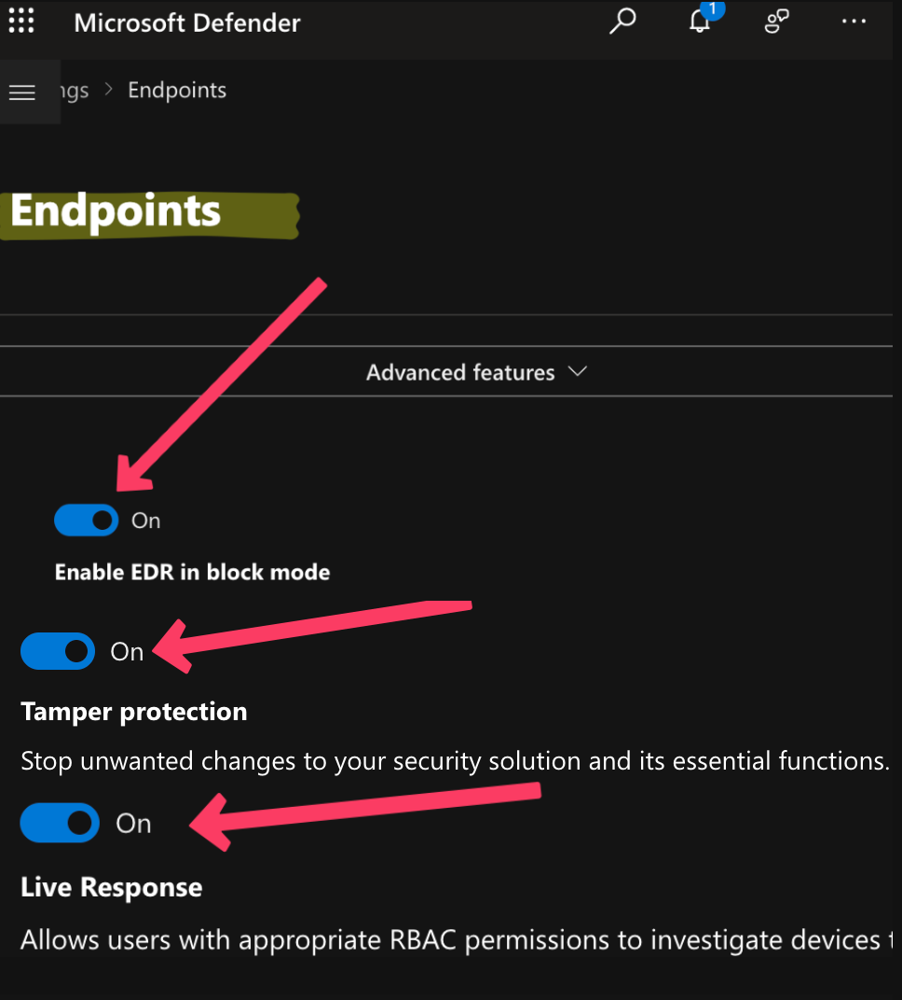
*Description: Global settings configured to enable EDR in block mode, Tamper Protection, and Live Response capabilities.*

### 3. Configuring Automated Investigation & Remediation (AIR)
I configured a specific device group for the endpoint, setting the remediation level to require analyst approval before taking destructive actions.

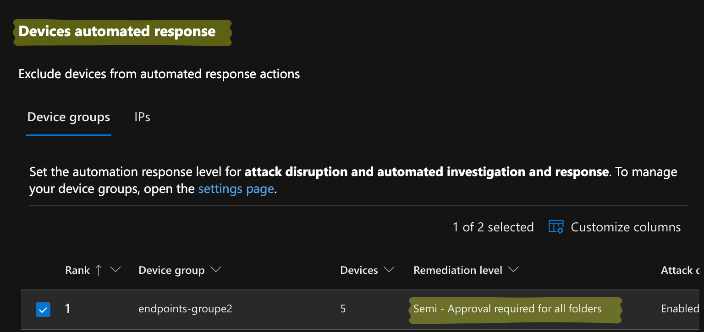
*Description: ** Configured the target device group (`endpoints-groupe2`) to Full Remediation to allow autonomous threat containment.*

### 4. Attack Surface Reduction (ASR)
To proactively shrink the attack surface, I implemented ASR rules targeting common malware delivery mechanisms (e.g., malicious Office macros).

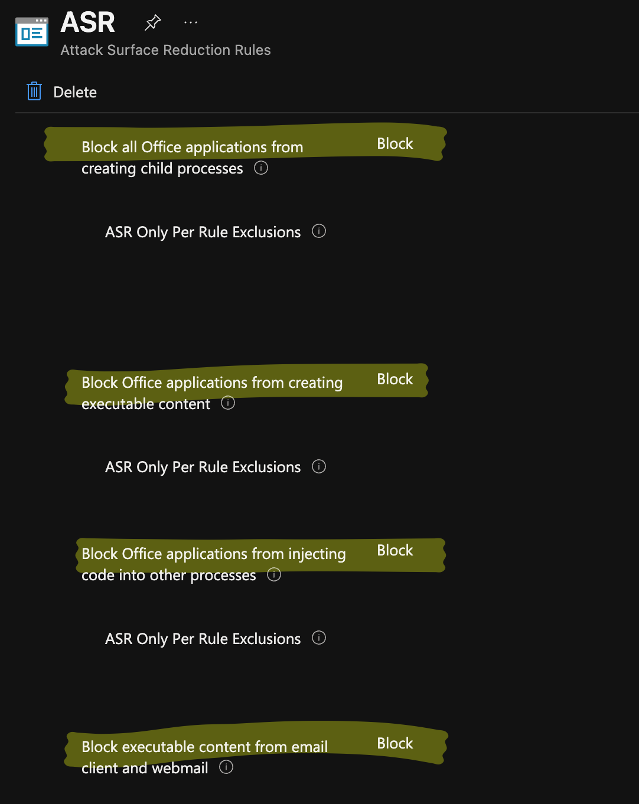
*Description: ASR rules actively deployed to block Office applications from creating child processes or injecting code.*

### 5. Alert Notifications
To ensure immediate visibility during an incident, I created a custom notification rule to route high-priority alerts to the SOC email.

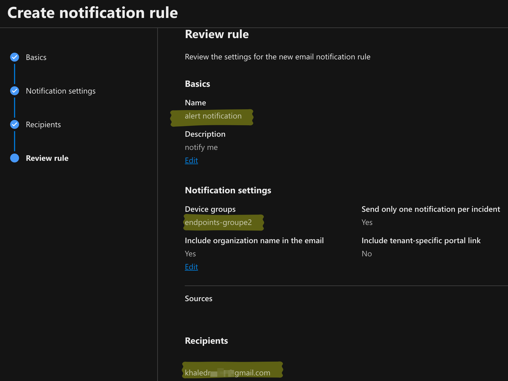
*Description: Custom email notification rule scoped to the target device group.*

### 6. Baseline Telemetry Validation
Before launching the attack, I ran a baseline KQL query to verify that Process Events were successfully routing from the VM to the Advanced Hunting logs.

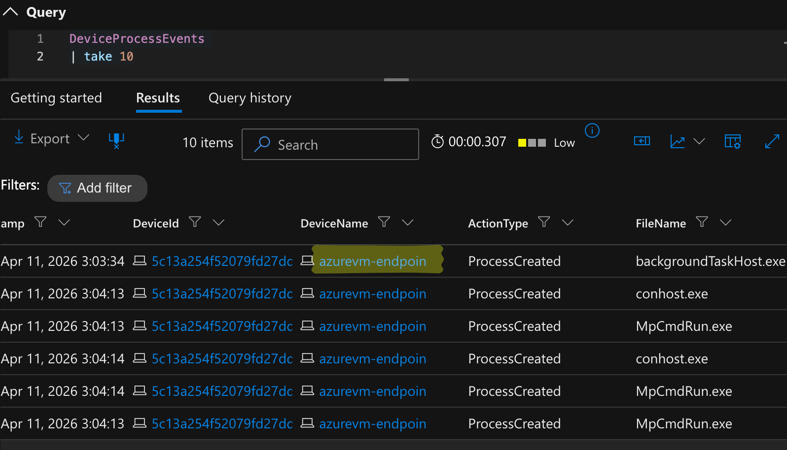
*Description: An Advanced Hunting query (`DeviceProcessEvents | take 10`) returning standard background processes, confirming healthy log ingestion.*

---

## Phase 2: Attack Simulation (Persistence)
To test the environment's defensive capabilities, I simulated a persistence technique commonly utilized by Advanced Persistent Threats (APTs) to survive system reboots.

**Execution Command:**
```powershell
schtasks /create /sc minute /mo 5 /tn "Updater" /tr "powershell.exe -Command whoami"
```

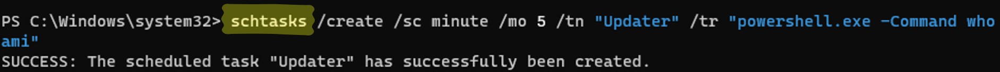
*Description: Execution of the malicious scheduled task payload via the command line on the victim VM.*

---

## Phase 3: Incident Triage & Response
Defender XDR immediately identified and intercepted the scheduled task payload, generating an incident for the SOC.

### 1. Alert Generation & Malware Blocking
Defender flagged the activity, attributing it to the 'Ceprolad' malware family, and proactively blocked the execution of the command line.

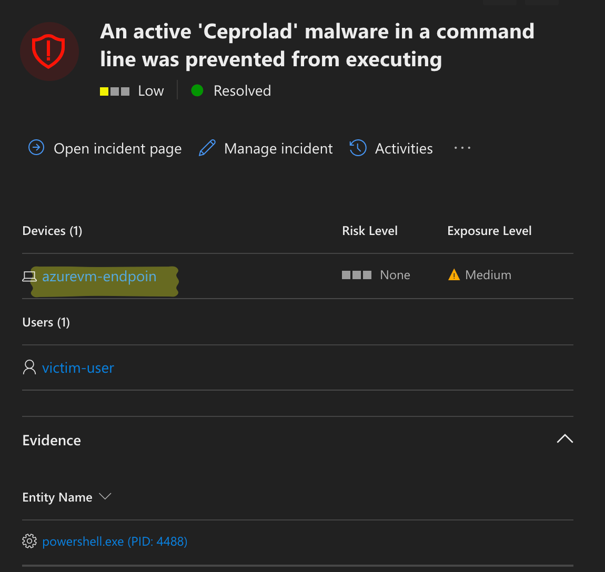
*Description: Incident dashboard showing the blocked 'Ceprolad' payload with a Medium exposure level.*

### 2. Process Tree & MITRE ATT&CK Mapping
Investigating the Alert Story revealed the exact execution chain. Defender successfully mapped the file capabilities to specific MITRE ATT&CK techniques.

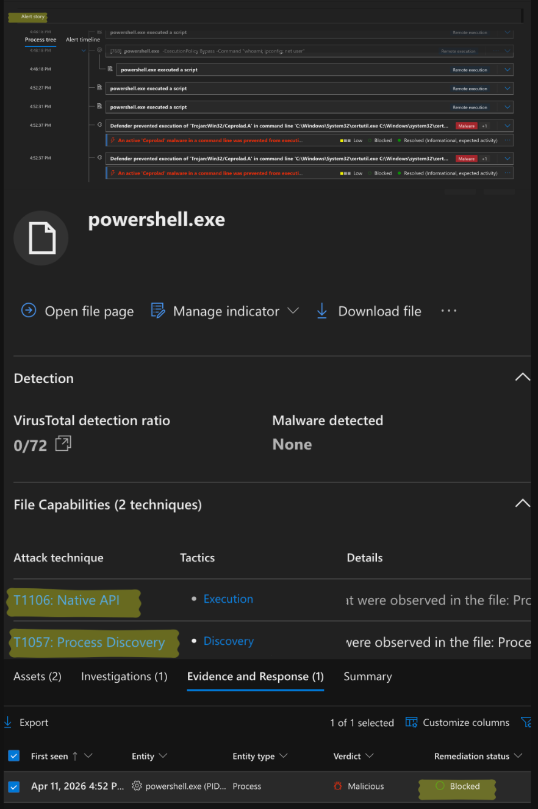
*Description: The incident timeline showing `powershell.exe` being blocked, alongside identification of T1106 (Native API) and T1057 (Process Discovery) techniques.*

---

## Phase 4: Custom Detection Engineering (KQL)
Relying solely on vendor-provided signatures is a reactive approach. To proactively detect any unauthorized scheduled task creation across the environment, I engineered a behavioral detection rule.

**Kusto Query Language (KQL) Logic:**
```kusto
DeviceProcessEvents
| where ProcessCommandLine contains "schtasks" and ProcessCommandLine has "/create"
| where not(InitiatingProcessFileName in ("explorer.exe", "services.exe"))
| project Timestamp, DeviceName, ActionType, FileName, ProcessCommandLine, InitiatingProcessFileName
```
*Tuning context: Legitimate parent processes (`explorer.exe`, `services.exe`) were intentionally excluded to minimize false positives and prevent SOC alert fatigue.*

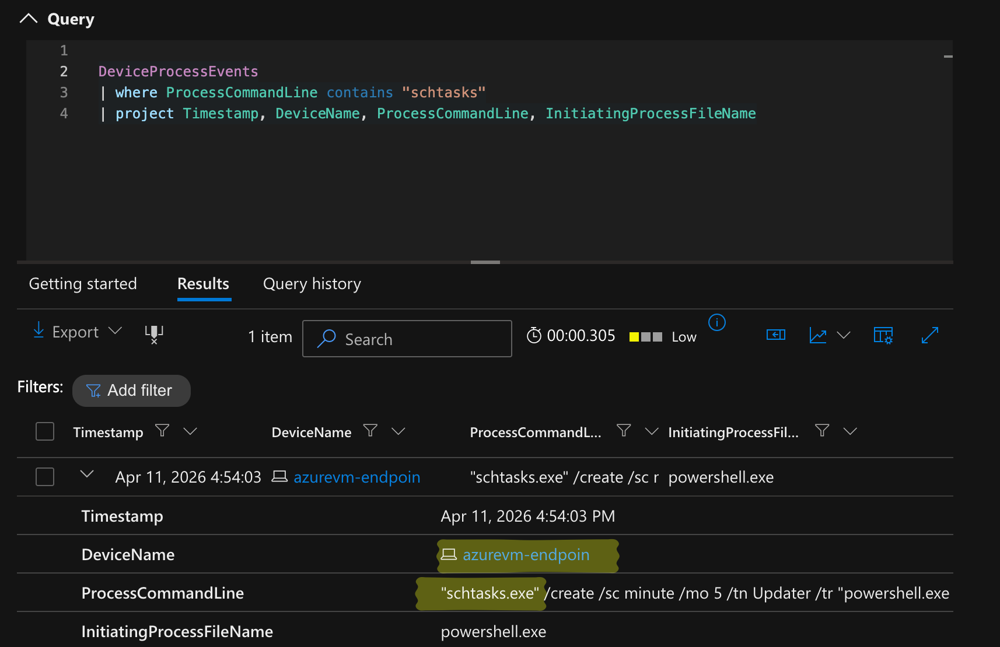
*Description: The custom KQL query successfully hunting for the specific `schtasks` behavior within the DeviceProcessEvents table.*

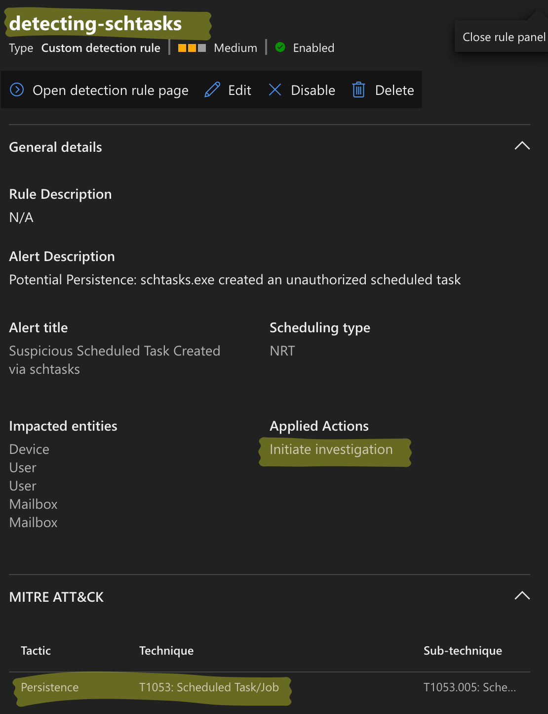
*Description: Configuration of a detection rule to automatically trigger an investigation upon future occurrences.*

---

## Phase 5: Incident Response Playbook
In a scenario where Automated Investigation is disabled or restricted to "Semi-Approval,"  I will execute manual containment. 

**Manual IR Execution Steps:**
1. **Containment:** Execute "Isolate Device" via the Defender portal to sever network connections while maintaining the MDE management channel.
2. **Forensic Acquisition:** Initiate a Live Response Session to collect memory dumps, running processes, and network connections.
3. **Remediation:** Remove the persistence mechanism remotely via Live Response:
   ```powershell
   schtasks /delete /tn "Updater" /f
   ```
4. **Eradication:** Terminate the initiating process (e.g., `powershell.exe`) and trigger a full, offline Microsoft Defender Antivirus scan.
5. **Post-Incident Activity:** Escalate to Tier 3/Threat Hunting to investigate the initial access vector and determine how the attacker gained execution privileges.

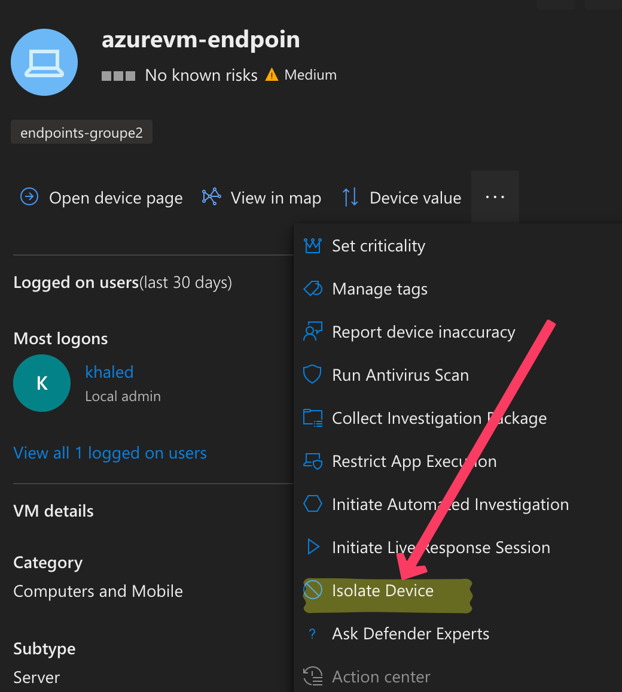
*Description: Executing the "Isolate Device" action from the Defender device inventory menu to achieve network containment.*
